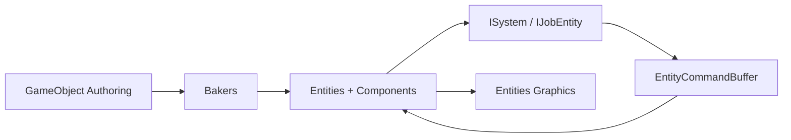

# Interview Guide

## 30-second project overview

This project is a Unity DOTS learning portfolio with four demos: Burst-driven moving cubes, DOTS Physics bouncing balls, boids flocking with a spatial-hash optimization path, and an ECS tower-defense loop. The goal is to show practical data-oriented design: authoring with GameObjects, baking into entities, then running high-volume simulation through systems, jobs, and Burst-friendly data.

## ECS flow

## Demo highlights

- Demo01 Moving Cubes: configurable entity count, Burst `IJobEntity` movement, and wrap-around bounds.
- Demo02 Bouncing Balls: DOTS Physics bodies, static arena colliders, and reset logic.
- Demo03 Flocking Agents: basic boids plus a spatial-hash system for neighbor lookup.
- Demo04 Tower Defense: wave spawning, targeting, projectile damage, base HP, win/lose state, HUD, and enemy health bars.

## Difficult problems and solutions

- Structural changes: spawning and destruction use `EntityCommandBuffer` so systems do not mutate entity archetypes during iteration.
- Burst compatibility: hot simulation code uses unmanaged component data, `Unity.Mathematics`, and simple loops.
- Projectile flicker: projectiles now set both `LocalTransform` and `LocalToWorld`, and same-frame hits apply damage without spawning a visible projectile.
- Boids scale: the spatial-hash mode stores agents in a `NativeParallelMultiHashMap` by grid cell so each agent checks nearby cells instead of sampling arbitrary agents.
- Hybrid UI: runtime HUD and health bars stay in MonoBehaviour/OnGUI because they are presentation-only and do not belong in the hot simulation path.

## Performance optimization story

The project optimizes by moving repeated high-volume work out of object-oriented per-object scripts and into cache-friendly ECS systems. Burst and jobs improve the CPU side, while Entities Graphics handles large numbers of simple renderable entities. The benchmark template is intentionally empty so results are measured on the target hardware rather than invented.

## Likely interview questions

### Why use DOTS instead of MonoBehaviour?

DOTS is useful when many objects share the same behavior and data shape. It improves cache locality, reduces managed allocation, and opens the door to Burst and job parallelism. MonoBehaviour is still better for small, unique, or UI-heavy features.

### What is the role of baking?

Baking converts authoring GameObjects into runtime entity data. It lets designers work with familiar scene objects while the game runs on ECS components.

### Why use an EntityCommandBuffer?

Structural changes such as instantiate, destroy, add component, and remove component cannot be performed freely while iterating entity queries. ECB records those changes and plays them back at a safe point.

### What makes spatial hashing faster for boids?

A naive neighbor search grows poorly as agent count rises. Spatial hashing groups agents into cells, so each agent only checks its own cell and adjacent cells. This reduces unnecessary distance checks.

### What would you improve next?

Add pooled projectiles, richer enemy archetypes, more robust benchmark automation, and a Demo Hub scene. For Demo03, add profiler captures comparing Basic and SpatialHash modes at 5k and 10k agents.
